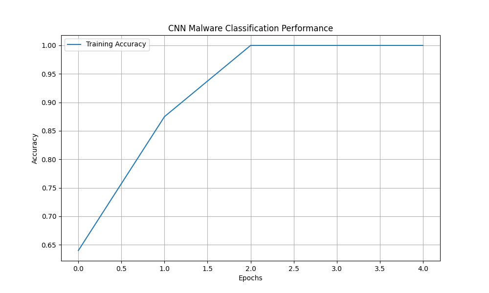

# Convolutional Neural Networks (CNN) in Cybersecurity

## 1. Theoretical Description
A Convolutional Neural Network (CNN) is a specialized deep learning architecture designed to process data with a grid-like topology $X \in \mathbb{R}^{H \times W \times C}$, such as images or time-series spectrograms.

### Mathematical Foundation
The core operation is the **discrete convolution**, where a kernel (filter) $K$ slides over the input image $I$. The output feature map $S$ at position $(i, j)$ is calculated as:

$$S(i, j) = (I * K)(i, j) = \sum_{m} \sum_{n} I(m, n) K(i-m, j-n)$$

This operation allows the network to capture **spatial dependencies** (local patterns) regardless of their position in the image.

### Architecture Components
1.  **Convolutional Layer:** Extracts features (edges, textures) using learnable kernels.
2.  **Activation Function (ReLU):** Introduces non-linearity: $f(x) = max(0, x)$.
3.  **Pooling Layer (Subsampling):** Reduces dimensionality to prevent overfitting and reduce computation. Max pooling selects the dominant feature in a region:
    $$h_{i,j} = \max_{(p,q) \in \Omega_{i,j}} x_{p,q}$$
4.  **Fully Connected (Dense) Layer:** Flattens the 2D feature maps into a 1D vector to perform the final classification probability.

## 2. Application: Malware Classification
In cybersecurity, CNNs are used for **Static Malware Analysis** via image conversion.
* **Method:** Binary executables are read as 8-bit integers (0-255). These integers are mapped to pixels in a grayscale image.
* **Rationale:** Variants of the same malware family (e.g., WannaCry) share code structures that manifest as identical "visual textures" in the image.
* **Advantage:** This approach detects malware based on structure rather than exact signature matching, making it resilient to minor code obfuscation.

### Practical Example & Code
I have implemented a CNN to classify synthetic malware samples.
* **Malware:** Simulated as images containing specific vertical artifacts (representing code blocks).
* **Benign:** Simulated as random noise entropy.

The source code `conv_net_code.py` generates this dataset and trains the model.
**Dataset:** The generated data is saved as `malware_data.npz` in this folder.

**Training Performance:**

