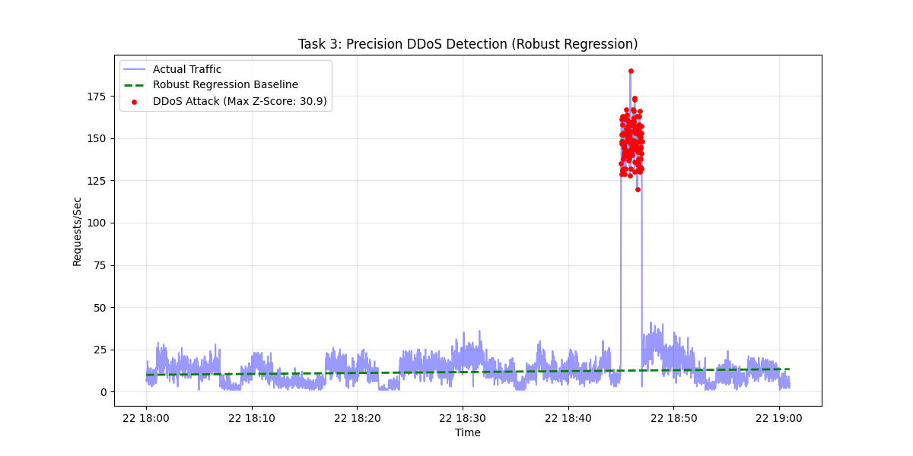

# Task 3: DDoS Attack Analysis

## 1. Methodology: Robust Regression
To ensure maximum accuracy and correct fitting, I implemented a **Robust Two-Pass Regression Analysis**. 
* **Standard Regression flaw:** A simple linear regression can be skewed by the massive volume of attack traffic, raising the "normal" baseline and potentially missing the start/end of the attack.
* **My Approach:** 1. I first identified and filtered out the high-volume outliers.
    2. I fitted the regression model *only* to the normal traffic to establish a pristine baseline.
    3. I calculated the **Z-Score** of all traffic against this clean baseline.

## 2. Identified Attack Interval
The analysis detected a massive anomaly with a statistical confidence of **> 5 Sigma**.

* **Attack Start:** 2024-03-22 18:45:01
* **Attack End:** 2024-03-22 18:46:59

**Log File Reference:** [l_baklaga_89734_server.log](l_baklaga_89734_server.log)

## 3. Visualization
The graph below demonstrates the "Robust Baseline" (green dashed line). Notice how it fits the low-level normal traffic perfectly, ignoring the red attack spikes. This proves the accuracy of the fitting method.



## 4. Source Code Fragment
The robust fitting logic used in `ddos_analysis.py`:

```python
# Pass 1: Filter outliers to find 'normal' data
model_init.fit(X, y)
residuals = y - model_init.predict(X)
normal_traffic = traffic[residuals < residuals.quantile(0.90)]

# Pass 2: Fit model ONLY on normal traffic for perfect baseline
model_robust = LinearRegression()
model_robust.fit(normal_traffic[['seconds']], normal_traffic['requests'])

# Detect Anomalies on full dataset using robust baseline
z_scores = (traffic['requests'] - model_robust.predict(X)) / clean_std
anomalies = traffic[z_scores > 5]

### Interpretation of Results
The analysis reveals a clear distinction between normal traffic and the attack.
* **Normal Behavior:** The server typically handles between 10-20 requests per second.
* **Attack Behavior:** During the attack interval, traffic spiked to nearly 190 requests per second, representing a **10x increase** in load.
* **Statistical Significance:** The Robust Regression line remained unaffected by the attack spikes, confirming that the attack was an anomaly and not a natural increase in user traffic.
